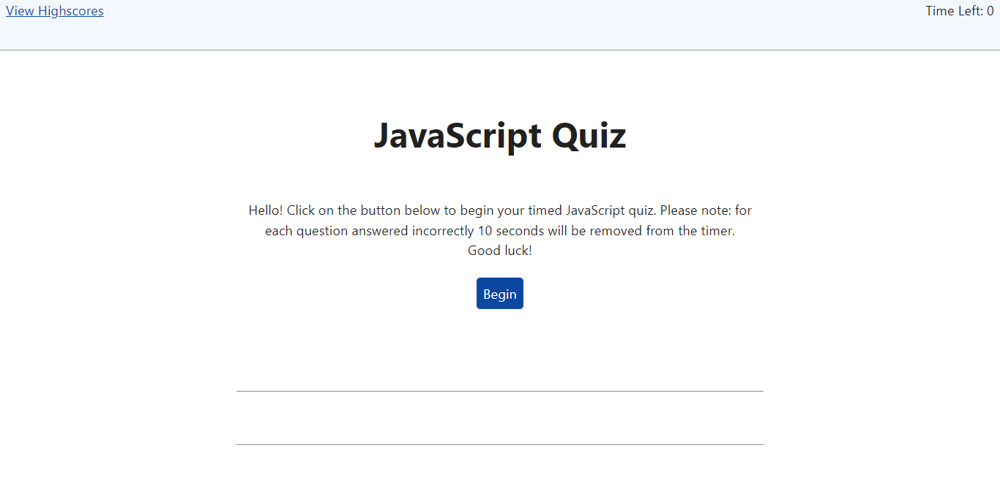
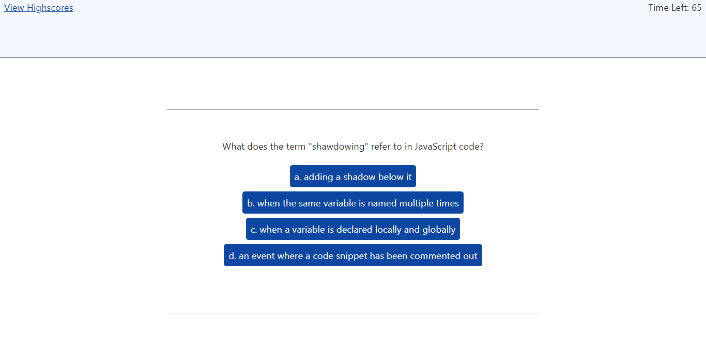
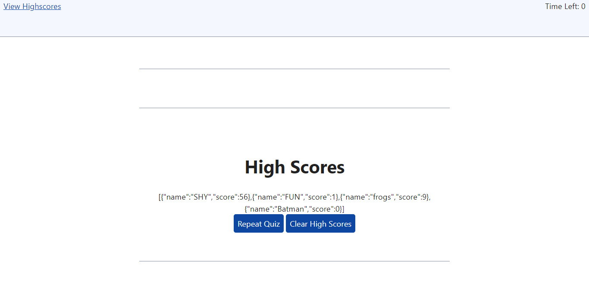

# quiz-WebAPIs-assignment

## Description
This webpage was styled with simplecss. The purpose of this challenge was to test my ability to use JavaScript code to update HTML and CSS on a webpage. The object of this challenge was a webpage that contains a timed quiz that allows the user to input their chosen name or initals and score. This value is then loaded into the local storage in order to keep a running list of the high scores, which is output onto the final page titled "High Scores". This challenge required me to create a timer, event listeners in JS, and iterable functions.

## Screenshots

## Link
[Quiz Webpage URL](https://sailorshy94.github.io/quiz-WebAPIs-assignment/)